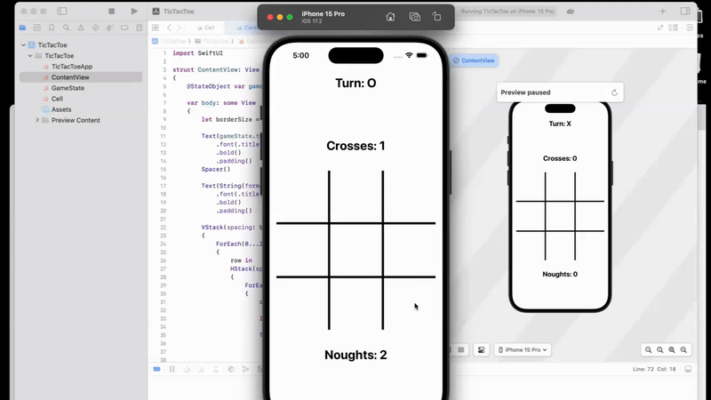

# 🎮 Swift Tic-Tac-Toe

A simple and interactive Tic-Tac-Toe game built using Swift and SwiftUI.

## 📱 Demo



## 🚀 Features

- Player vs Player mode
- Turn indicator
- Clean and modern UI using SwiftUI

## 🛠 Technologies

- Swift
- SwiftUI
- MVVM pattern


## 📂 How to Run

1. Clone the repository:
   ```bash
   https://github.com/EhsanMousaviMsl/TicTacToe.git
